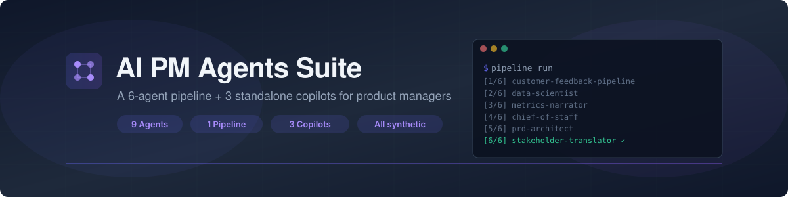

<div align="center">



# 🧠 AI PM Agents Suite

**A unified collection of AI agents for product managers — a 6-agent orchestrated pipeline plus 3 standalone single-purpose agents, all in one place.**

[](https://claude.ai)
[](https://claude.ai/code)
[](https://github.com/features/copilot)
[](./LICENSE)

[**Quick Start**](#quick-start) · [**What's Inside**](#whats-inside) · [**When to use which**](#when-to-use-which) · [**Documentation**](#documentation)

</div>

**Built by [Varun Kulkarni](https://github.com/varunk130)** · Works with Claude Code & GitHub Copilot · [Contributing](./CONTRIBUTING.md)

> **⚠️ Disclaimer:** All data in this project is entirely synthetic and mock-generated for demonstration purposes. No real customer data, proprietary information, or actual business metrics were used.

---

## What's inside

```
ai-pm-agents-suite/
├── pipelines/feedback-to-strategy/     6-agent orchestrated pipeline
└── agents/                              3 standalone single-purpose agents
```

### 1️⃣ The 6-agent pipeline → end-to-end synthesis

Lives in [`pipelines/feedback-to-strategy/`](./pipelines/feedback-to-strategy/).

Turns **50 raw customer feedback tickets + 6 months of product metrics** into:

- A prioritized strategic recommendation
- A complete PRD
- 5 audience-tailored stakeholder communications

| # | Agent | Cognitive function |
|---|-------|--------------------|
| 1 | [Customer Feedback Pipeline](./pipelines/feedback-to-strategy/agents/01-customer-feedback-pipeline/) | Pattern Recognition |
| 2 | [Data Scientist](./pipelines/feedback-to-strategy/agents/02-data-scientist/) | Quantitative Validation |
| 3 | [Metrics Narrator](./pipelines/feedback-to-strategy/agents/03-metrics-narrator/) | Synthesis |
| 4 | [Chief of Staff](./pipelines/feedback-to-strategy/agents/04-chief-of-staff/) | Strategic Reasoning |
| 5 | [PRD Architect](./pipelines/feedback-to-strategy/agents/05-prd-architect/) | Specification |
| 6 | [Stakeholder Translator (pipeline)](./pipelines/feedback-to-strategy/agents/06-stakeholder-translator/) | Audience Adaptation |

### 2️⃣ Standalone agents → single-step skills

Live in [`agents/`](./agents/).

| Agent | Cognitive function | Use when |
|-------|--------------------|----------|
| [Decision Engine](./agents/decision-engine/) | Strategic Reasoning | A single decision needs multi-framework analysis |
| [Financial Analyst](./agents/financial-analyst/) | Quantitative Modeling | You need a defensible business case for a feature |
| [Stakeholder Translator (standalone)](./agents/stakeholder-translator/) | Audience Adaptation | One product update needs to be reshaped for 5 audiences |

---

## When to use which

| Situation | Reach for |
|-----------|-----------|
| You have qualitative + quantitative data and need an end-to-end synthesis into PRD + strategy + comms | **The 6-agent pipeline** |
| You have one decision that needs structured multi-framework analysis | **Decision Engine** |
| You need a feature business case with sensitivity analysis | **Financial Analyst** |
| You need to communicate a single update to 5 audiences | **Stakeholder Translator (standalone)** |

See [`docs/comparison.md`](./docs/comparison.md) for the full decision tree.

---

## Quick start

```bash
# Frontend (React 19 + Vite 7 dashboard)
npm install
npm run dev          # http://localhost:5173

# Python pipeline orchestrator
python -m venv .venv
.\.venv\Scripts\Activate.ps1     # Windows
# source .venv/bin/activate      # macOS / Linux
pip install -r requirements.txt
cd pipelines/feedback-to-strategy
python -m pipeline.cli run
```

## Documentation

- [`docs/overview.md`](./docs/overview.md) — what this suite is and how it's organized
- [`docs/architecture.md`](./docs/architecture.md) — how the pipeline and standalone agents are designed
- [`docs/agent-catalog.md`](./docs/agent-catalog.md) — quick reference for every agent
- [`docs/comparison.md`](./docs/comparison.md) — when to use the pipeline vs a standalone agent
- [`docs/use-cases.md`](./docs/use-cases.md) — real PM scenarios mapped to agents

---

<p align="center"><sub>Built by <a href="https://github.com/varunk130">Varun Kulkarni</a> · MIT licensed · All data synthetic</sub></p>
